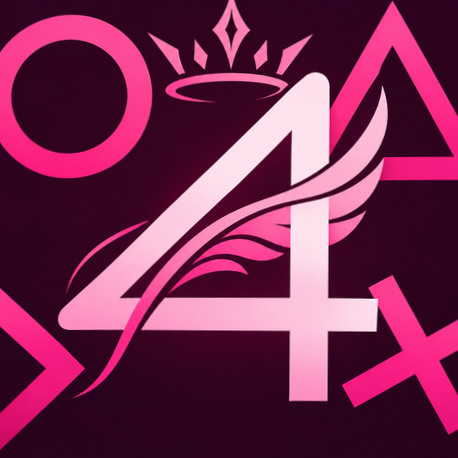
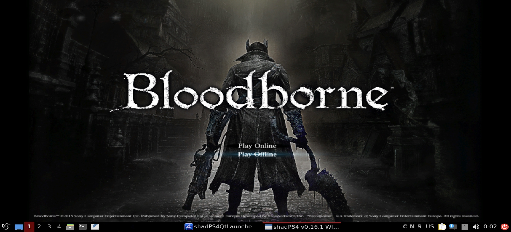
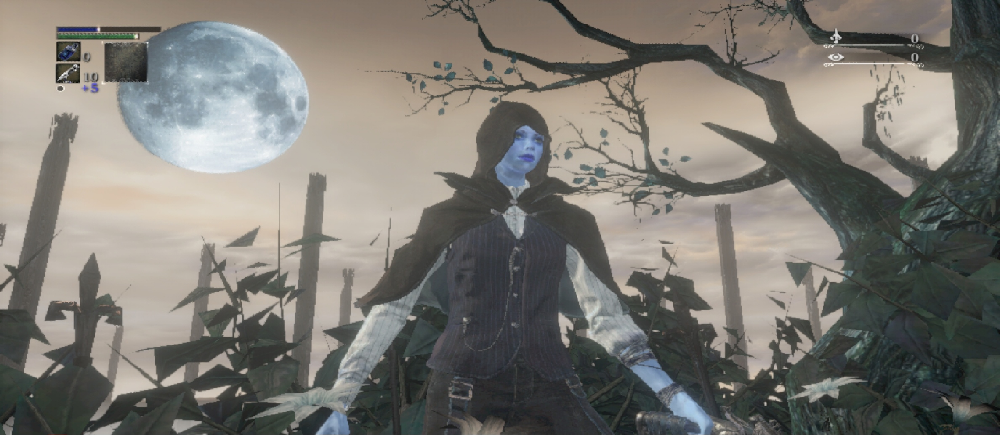
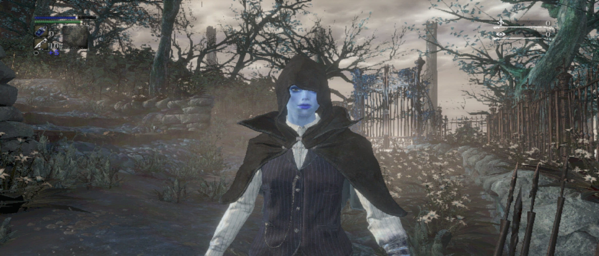

<div align="center">



# ✦ Seraphim ✦

### Native ARM64 Linux build of shadPS4

[](https://github.com/SeraphBella/BachZenithARM64/releases/tag/v0.1)


<br>

[](https://www.instagram.com/despair.waifu.cos/)
[](https://www.tiktok.com/@despair.waifu.cos)
[](https://www.reddit.com/user/Ok_tomorrow_8774/)

<br>

*Bringing shadPS4 to native AArch64 Linux — developed and tested on Snapdragon 8 Elite.*

</div>

---

## ✦ Seraphim in action

<div align="center">

### Bloodborne — Launch



**Bloodborne 01.09 (CUSA03173)**<br>
*Snapdragon 8 Elite • Adreno 830 • Seraphim v0.1*

<br>

<table>
<tr>
<td align="center" width="50%"><b>Hunter's Dream</b></td>
<td align="center" width="50%"><b>Hunter close-up</b></td>
</tr>
<tr>
<td width="50%"></td>
<td width="50%"></td>
</tr>
</table>

**Native ARM64 gameplay — Snapdragon 8 Elite / Adreno 830**

</div>

---

## Seraphim v0.1 — ARM64 Linux Experimental

BachZenithARM64 is an experimental native ARM64 Linux build of
shadPS4, accompanied by an ARM64 build of shadPS4 QtLauncher.

The goal of the project is to explore running PlayStation 4 software
through shadPS4 on ARM64 Linux systems without running the emulator
itself as an x86-64 application.

> [!WARNING]
> This is experimental software.
>
> Compatibility, stability and performance are not guaranteed.
> Seraphim v0.1 is an early ARM64 Linux release intended for testing
> and development.

---

**Seraphim v0.1 is the initial public experimental release.**

### Tested hardware

Development and testing were performed on:

- Qualcomm Snapdragon 8 Elite
- Adreno 830
- ARM64 / AArch64 Linux
- Ubuntu 24.04 userspace

Other ARM64 systems may work but have not necessarily been tested.

### Bloodborne

Bloodborne (CUSA03173 / version 01.09) has been used as the primary
real-world test workload during development.

The game reaches gameplay on the tested Snapdragon 8 Elite / Adreno
830 system.

Performance depends heavily on game patches, rendering resolution,
GPU drivers and system configuration.

This should NOT be interpreted as a general compatibility guarantee
for Bloodborne or other PlayStation 4 titles.

---

## Repository layout

    core/
        ARM64 shadPS4 source snapshot

    qtlauncher/
        ARM64 shadPS4 QtLauncher source snapshot

    SOURCE_COMMITS.txt
        Source snapshot provenance

Binary releases are distributed separately through GitHub Releases.

---

## Source provenance

The Seraphim v0.1 source snapshot contains two components.

### ARM64 shadPS4 core

Release snapshot:

    bec64c74 — Zenith ARM64 native release snapshot

Base:

    be6bc2e9c60799e071dd2fafa6216e8d80ec619c

### ARM64 QtLauncher

Release snapshot:

    6c6c638 — ARM64 QtLauncher release snapshot

Base:

    4ce2f029c824fe3cb9dac80673b406baa6d22617

See `SOURCE_COMMITS.txt` for the recorded release provenance.

---

## Binary release

Seraphim v0.1 contains native AArch64 Linux executables:

    bin/shadps4
    bin/shadPS4QtLauncher

SHA-256 checksums are supplied with the release.

Seraphim v0.1 golden binary hashes:

    shadps4
    66a4644e5bc71d4c0ff6a7042f49a02034269c0bfb48b06212fa909d468ea1c4

    shadPS4QtLauncher
    70c6dba13543b37cecbc33b9217803601403909ab35ee33c6c3c725abecf3f15

---

## Runtime requirements

These binaries are dynamically linked ARM64 Linux executables.

The shadPS4 core requires standard AArch64 Linux runtime libraries.

The QtLauncher additionally requires Qt 6 and associated multimedia,
graphics, networking, audio and X11/Linux runtime libraries.

The initial release is not a universal or fully self-contained Linux
package. Exact runtime requirements may vary by distribution.

Ubuntu 24.04 ARM64 is the reference environment for Seraphim v0.1.

---

## GPU and Vulkan

A working Vulkan implementation is required.

The development platform uses an Adreno 830 GPU.

Performance and compatibility can vary substantially depending on:

- Vulkan driver
- Mesa/Turnip version
- GPU
- kernel
- game
- selected patches
- rendering resolution

---

## Legal

BachZenithARM64 does not include PlayStation 4 games, firmware,
copyrighted game assets, keys, or other proprietary Sony software.

Users are responsible for obtaining and using software in accordance
with applicable laws and licenses.

This repository contains work derived from the shadPS4 ecosystem (both Zennith's and BachataPs4, so is Upstream Shadps4) .
Original project copyright and licensing notices are preserved in
the respective source trees.

See:

    core/LICENSES/
    qtlauncher/LICENSES/

for included licensing material.

---

## Project status

**Seraphim v0.1**

ARM64 Linux — Experimental

Primary development target:

**Snapdragon 8 Elite / Adreno 830**

Project repository:

**SeraphBella/BachZenithARM64**

---

## Ubuntu ARM64 installation

Seraphim v0.1 is a native ARM64 Linux build.

Tested development environment:

- Ubuntu 24.04 ARM64
- AArch64 / ARM64 CPU
- Vulkan-capable GPU and ARM64 Vulkan driver

### Install runtime dependencies

```bash
sudo apt update
sudo apt install -y \
  libatomic1 \
  libudev1 \
  libuuid1 \
  libssl3t64 \
  libopenal1 \
  libqt6core6t64 \
  libqt6gui6t64 \
  libqt6widgets6t64 \
  libqt6network6t64 \
  libqt6concurrent6t64 \
  libqt6multimedia6 \
  libglx0 \
  libopengl0 \
  libvulkan1 \
  mesa-vulkan-drivers
```

The Qt GUI also requires a working graphical environment such as X11 or Wayland.

### Extract the release

```bash
tar -xJf BachZenithARM64-Seraphim-v0.1.tar.xz
cd BachZenithARM64-Seraphim-v0.1
```

### Launch QtLauncher

```bash
./bin/shadPS4QtLauncher
```

### Launch the shadPS4 core directly

```bash
./bin/shadps4
```

### Verify release binaries

```bash
sha256sum -c SHA256SUMS
```
---

## Android / Termux chroot notes

Seraphim v0.1 can run inside an ARM64 Ubuntu chroot on Android.

However, Android or vendor-specific process management may freeze or terminate long-running Termux, Termux:X11, or emulator processes.

### OnePlus / OxygenOS

The primary Android development environment for Seraphim v0.1 uses:

- OnePlus 13
- Snapdragon 8 Elite / Adreno 830
- Android 16 / OxygenOS
- Root access
- Termux
- Termux:X11
- Ubuntu 24.04 ARM64 chroot

On OnePlus/Oplus devices, the Hans/OFreezer subsystem may interfere with long-running Termux and Termux:X11 sessions.

The tested development configuration exempts:

- `com.termux`
- `com.termux.x11`

from Hans freezing/restrictions using **Oplus Hans Policy**.

Oplus Hans Policy:

https://github.com/whitewhale0612/Oplus-Hans-Policy

This is an **Android host configuration**, not a runtime dependency of the BachZenithARM64 binaries.

Native ARM64 Linux systems do not require Oplus Hans Policy.

Other Android vendors and ROMs may use different process-management systems and may require different configuration.

> **Important:** Root/system modifications can affect device stability and security. Only apply Android system modifications if you understand their effects and have an appropriate recovery method.


> **Note:** Seraphim v0.1 is experimental. Hardware and driver compatibility may vary, particularly across ARM64 GPU platforms.
